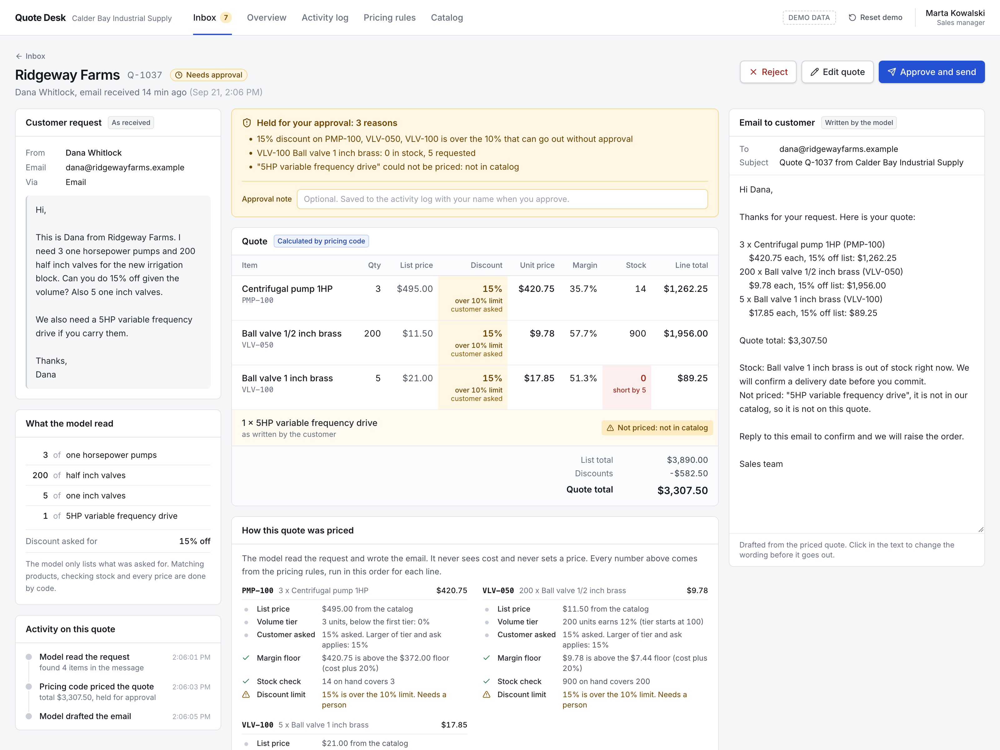
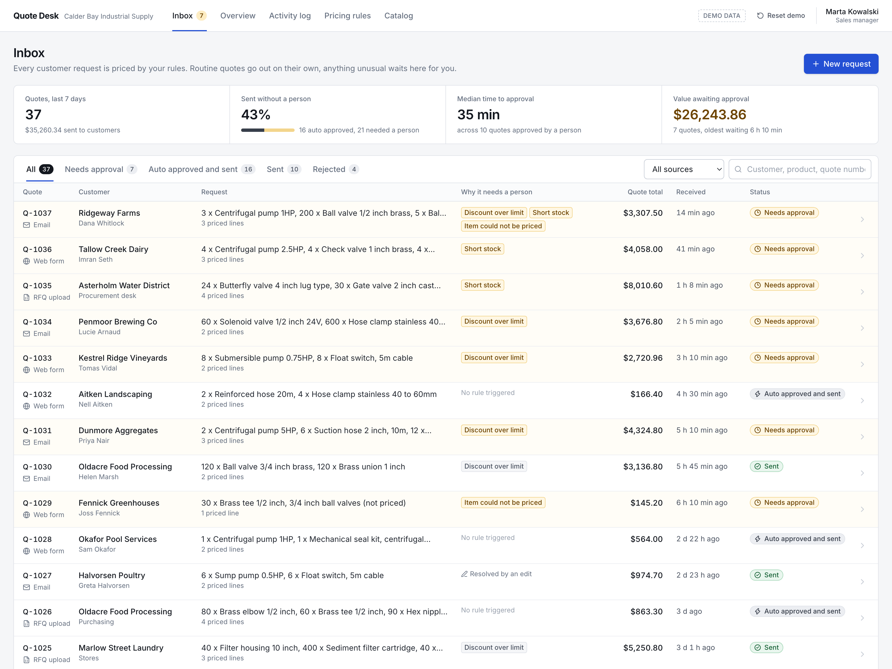
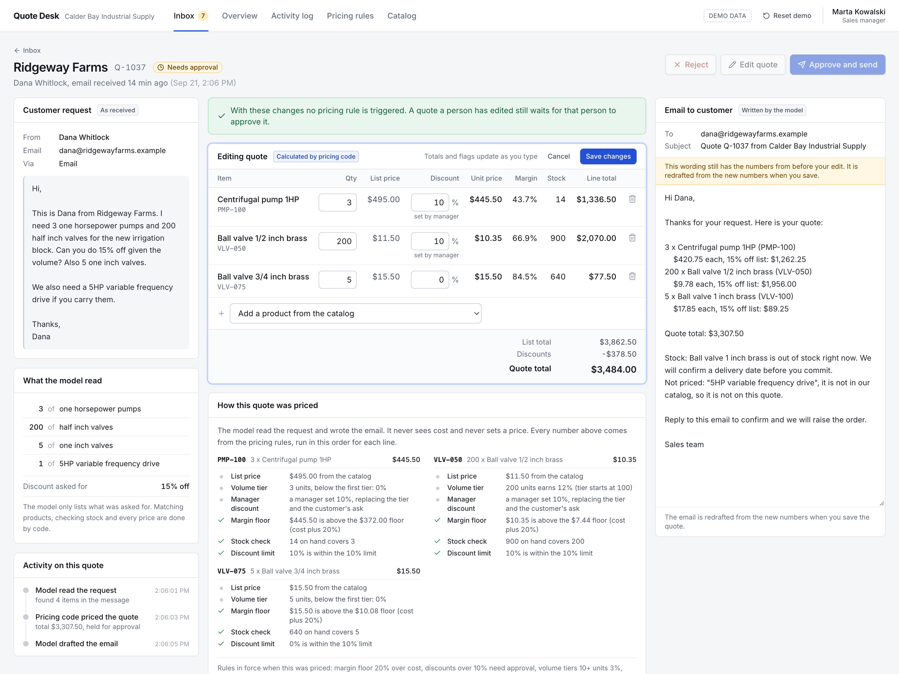
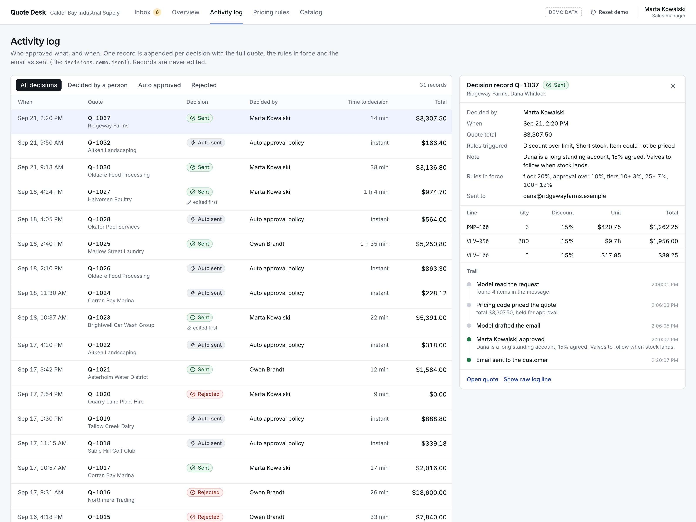
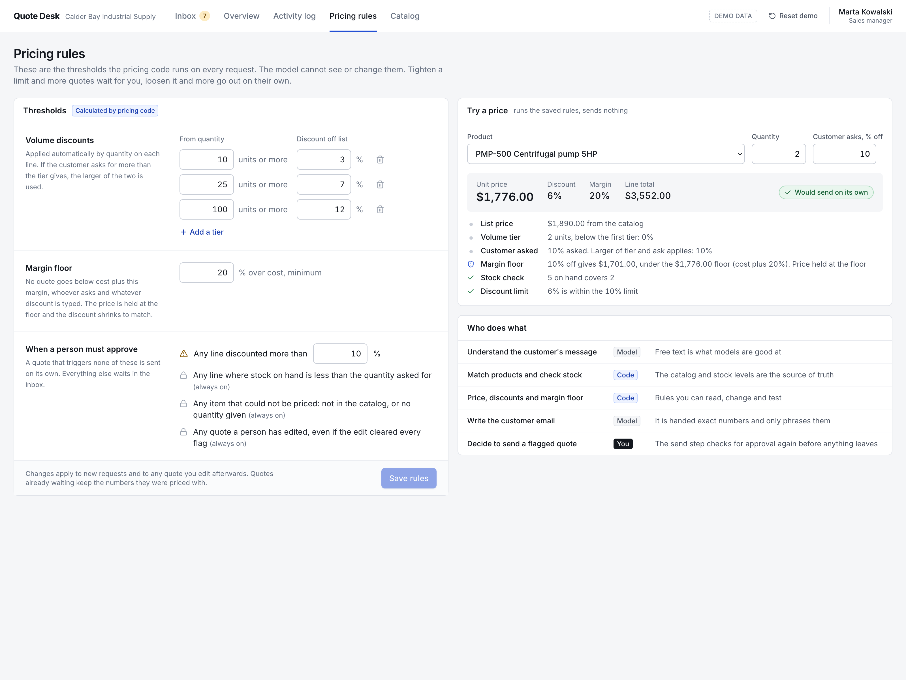
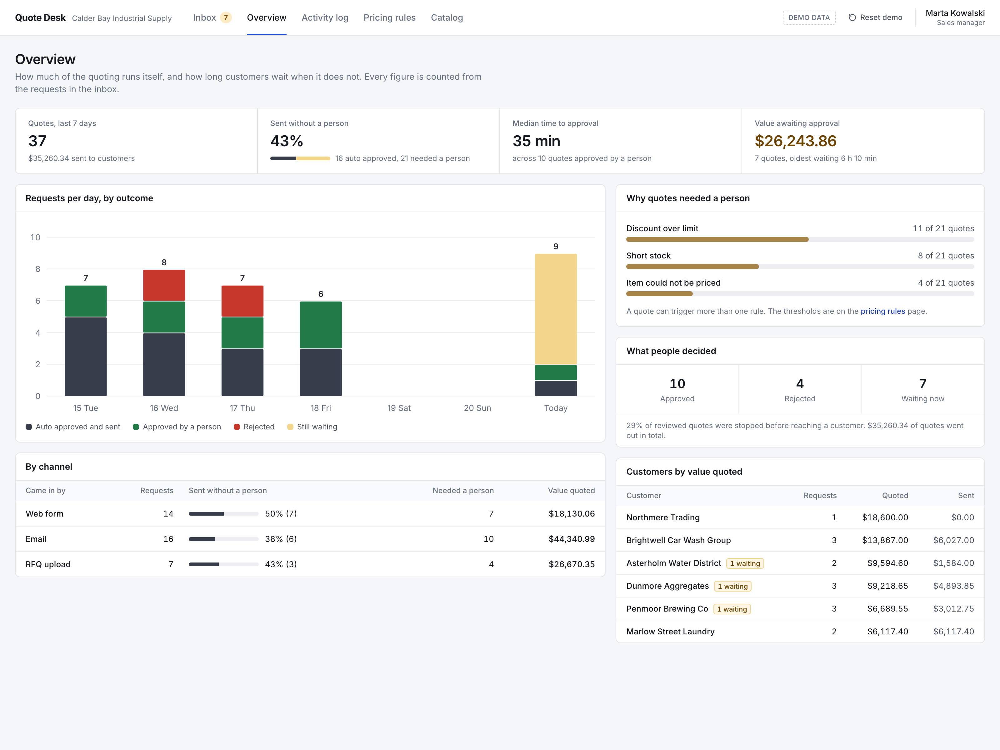

# Quote Desk

**AI sales quoting with a manager approval inbox.** Python, FastAPI, LangGraph, Claude, React, TypeScript, Tailwind. 28 tests. Runs offline with one command, or in Docker.

Sales teams lose deals while quotes sit in an inbox, and lose margin when someone rushes one out. Quote Desk prices every incoming request in seconds with your own rules, sends the routine ones on its own, and holds anything unusual for a manager to approve before it reaches the customer.



## What it does

- **One inbox for every request.** Web form, email and uploaded RFQ files land in the same list with a status: needs approval, auto approved and sent, sent, rejected. Filters, search and counts all work.
- **Approve before it sends.** A discount over your limit, short stock, or an item that could not be priced stops the quote and tells the manager exactly why, on the line where it happened.
- **The AI never sets a price.** The model reads the customer's message and words the email. Products, stock, tiers, the margin floor and every total come from plain code, and each quote shows the rule trail that produced its numbers.
- **Edit, then watch it reprice.** Change a quantity or a discount and the totals and flags recompute live through the same pricing code. The margin floor holds whatever anyone types.
- **A full audit trail.** Who approved or rejected what, when, with what note, the rules in force and the email as sent. One append only record per decision.
- **Rules you can read and change.** Volume tiers, margin floor and approval triggers are on a settings screen, with a calculator that shows how any product would price.
- **Numbers that are counted, not claimed.** Share of quotes sent without a person, median time to approval and value waiting are computed from the requests in the inbox.



The demo is a fictional distributor of pumps, valves and fittings. At startup 37 customer requests are run through the real pipeline, so every status, total and metric on screen is an actual result. Nothing is a mockup: paste a new request and it is read, priced, drafted and routed in front of you.

## Screens

| | |
|---|---|
|  |  |
| Edit a quantity or discount and the totals and flags recompute through the real pricing code. | Every approval and rejection, with who, when, the note, and the full decision record. |
|  |  |
| Volume tiers, margin floor and approval triggers, with a price calculator. | Quotes this week, share sent without a person, time to approval, value waiting. |

## Run it

```bash
make demo          # builds the web app, seeds the demo, serves everything on http://localhost:8101
```

Needs Python 3.11+ and Node 20+. No API key and no network: a scripted stand in plays the model. "Reset demo" in the top bar (or a restart) puts the data back exactly as it was.

```bash
make test                                   # 28 tests, no network
node scripts/e2e_smoke.mjs                  # clicks through the real UI in headless Chrome (demo must be running)
make screenshots                            # recaptures docs screenshots
docker compose up --build                   # same app in a container, port 8101

QUOTE_DESK_LIVE=1 ANTHROPIC_API_KEY=... make demo    # new requests use Claude, seeding stays scripted and free
```

The original command line demo still works:

```bash
python -m quote_agent                      # offline, scripted model
ANTHROPIC_API_KEY=... python -m quote_agent --live "I need 3 one horsepower pumps and 200 half inch valves, can you do 15% off?"
```

## Why it is built this way

Most "AI quoting" demos let the model invent prices. This one does not. The split is deliberate:

| Step | Who does it | Why |
|---|---|---|
| Understand the request | Model | Free text is what models are for |
| Resolve products, check stock | Code (ERP) | The ERP is the source of truth |
| Price, discounts, margin floor | Code | Rules must be readable and testable (`pricing.py`) |
| Write the customer email | Model | Given exact numbers, it only phrases them. It is never shown cost or margin |
| Decide to send | Human | Anything over a 10% discount, short stock, or an unpriceable item stops here |

```
request -> extract (model) -> price (code) -> draft (model) -> [approval gate] -> send -> log
                                                   \-> auto approve (no rule triggered) -/
```

The graph is a LangGraph `StateGraph` compiled with `interrupt_before=["approval"]`. It pauses, a person sets `approved`, and only then does `send` run. `send` re-checks `approved` itself, so a bug in the gate cannot leak a quote; there is a test that resumes the graph without an approval and proves nothing goes out. With `auto_approve=True` (the web app), a quote that triggers no rule and that nobody has edited takes the `auto_approve` branch instead. A quote a person has touched always waits for that person, even if the edit cleared every flag. Every run appends the full state to a JSONL decision log, which is what the Activity log screen reads.

Engineering notes on the web layer:

- `pricing.py` is still pure functions. `PricingRules` is a frozen value whose defaults are the module constants; the live preview, the saved edit and the rules calculator all call the same `price_items`.
- An edit is fed back into the graph as if `extract` had produced it (`update_state(..., as_node="extract")`), so `price` and `draft` really run again and the graph stops at the gate again. The web layer holds no quote state of its own: it reads the graph's checkpointer.
- The scripted model (`DemoLLM`) is honest and simple: phrase splitting, a quantity finder that knows a size from a count ("5 one inch valves"), one discount regex. It knows nothing about the catalog or prices. Unknown products stay unknown and get flagged, they are never guessed.
- The demo clock starts at 2:20 pm on the most recent weekday, so the seeded week reads like a working week whenever you start it. Set `QUOTE_DESK_REAL_CLOCK=1` to use the wall clock.

## Swap in a real ERP

`MockERP` reads `fixtures/catalog.json`. Implement `resolve_sku(text)` and `get_product(sku)` against Odoo, NetSuite, or whatever you run, and pass it to `build_graph`. Nothing else changes. The `mailer` argument of `build_graph` is the one place a real email or CRM call goes.

## Layout

```
quote_agent/
  erp.py       mock ERP + the interface a real one must satisfy
  pricing.py   volume tiers, margin floor, approval thresholds, rule trail (pure functions)
  llm.py       the two prompts, Anthropic client, scripted stand ins for tests and the demo
  graph.py     LangGraph nodes, the approval gate, auto approve branch, decision log
  service.py   Quote Desk: inbox, edit, approve, reject, rules, overview (drives the graph)
  api.py       FastAPI JSON API under /api, serves the built web app at /
  __main__.py  CLI demo
web/           React 19, TypeScript, Vite, Tailwind CSS v4
fixtures/      catalog (35 SKUs) and the 37 seeded customer requests
tests/         pricing rules, the gate, the API, the scripted model
scripts/       screenshot capture, UI smoke test
```

MIT.
